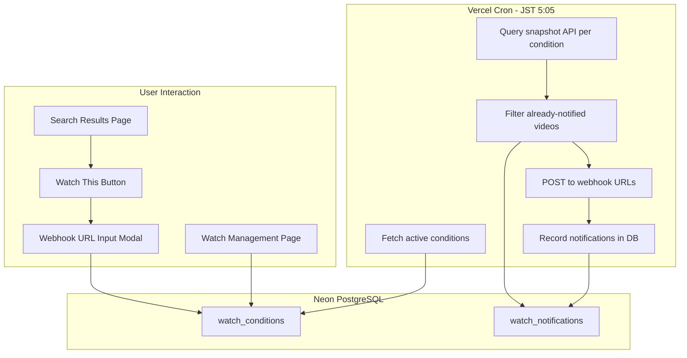

# Watch & Webhook 設計書

Snapshot API の日次更新を検知し、ユーザーごとの検索条件に合致する新着動画を指定の webhook URL へ通知する機能。

## 制約

| 制約 | 値 | 影響 |
|------|-----|------|
| Vercel Hobby 関数タイムアウト | 10秒 | 1回の cron 実行で処理できる条件数に上限がある |
| Vercel Hobby Cron Jobs | 2ジョブ、最小間隔 1日 | snapshot 更新が1日1回なので合致 |
| Neon free tier ストレージ | 0.5GB | 通知ログの保持期間を制限する必要がある |
| Snapshot API レート制限 | レスポンス時間と同等の待機 | 実測100-200ms/リクエスト、10秒で30-50条件を処理可能 |
| Snapshot API の性質 | 検索API (差分APIではない) | startTime フィルタで新着を絞り込む |
| 認証 | なし | UUID トークンでアクセス制御 |

## アーキテクチャ

### 全体フロー



### 処理シーケンス (Cron)

```
JST 5:05 に Vercel Cron が /api/watch/cron を呼び出す

1. DB から is_active=true の全 watch_conditions を取得
2. 各 condition について:
   a. condition の query/targets/filters から snapshot API のクエリパラメータを組み立て
   b. filters に startTime >= condition.last_checked_at を追加 (新着のみ取得)
   c. snapshot API を呼び出し (limit=100)
   d. DB から この condition で通知済みの content_id 集合を取得
   e. レスポンスから通知済みを除外 → new_videos
   f. new_videos が空なら次の condition へ
   g. webhook_url へ new_videos を含むペイロードを POST
   h. DB に通知ログを挿入
   i. condition.last_checked_at を更新
3. 30日以上前の watch_notifications を削除 (DB容量節約)
```

## データモデル

### watch_conditions テーブル

| カラム | 型 | 説明 |
|--------|-----|------|
| id | UUID | PK |
| token | UUID | 管理ページアクセス用。URL に埋め込む |
| label | TEXT | ユーザーが付けるラベル (例: "VOCALOID新着") |
| query | TEXT | 検索キーワード (snapshot API の q パラメータ) |
| targets | TEXT | 検索対象フィールド (例: "title,tags") |
| filters_json | JSONB | startTime 以外のフィルタ条件 |
| webhook_url | TEXT | 通知先 URL |
| webhook_format | TEXT | "generic" or "discord"。デフォルト "generic" |
| is_active | BOOLEAN | 一時停止フラグ。デフォルト true |
| last_checked_at | TIMESTAMP | 最後にチェックした日時 |
| created_at | TIMESTAMP | 作成日時 |

### watch_notifications テーブル

| カラム | 型 | 説明 |
|--------|-----|------|
| id | UUID | PK |
| condition_id | UUID | FK → watch_conditions.id |
| content_id | TEXT | ニコニコの動画 ID |
| notified_at | TIMESTAMP | 通知送信日時 |

インデックス:
- `watch_notifications(condition_id, content_id)` — 重複チェック用の UNIQUE 制約
- `watch_notifications(notified_at)` — 古いログの定期削除用

## API エンドポイント

### POST /api/watch

条件を新規作成する。

Request body:
```json
{
  "label": "VOCALOID新着",
  "query": "VOCALOID",
  "targets": "title,tags",
  "filters": { "viewCounter": { "gte": 1000 } },
  "webhookUrl": "https://discord.com/api/webhooks/...",
  "webhookFormat": "discord"
}
```

Response:
```json
{
  "id": "uuid",
  "token": "management-token-uuid",
  "manageUrl": "/watch/management-token-uuid"
}
```

### GET /api/watch/[token]

トークンに紐づく条件の詳細を取得する。

### PATCH /api/watch/[token]

条件を更新する (label, webhookUrl, is_active 等)。

### DELETE /api/watch/[token]

条件を削除する。関連する watch_notifications も CASCADE で削除。

### POST /api/watch/cron

Vercel Cron から呼び出される。Authorization ヘッダで `CRON_SECRET` を検証する。

## Webhook ペイロード

### Generic 形式

```json
{
  "condition": {
    "id": "uuid",
    "label": "VOCALOID新着",
    "query": "VOCALOID"
  },
  "videos": [
    {
      "contentId": "sm12345678",
      "title": "Example Title",
      "url": "https://nico.ms/sm12345678",
      "thumbnailUrl": "https://...",
      "viewCounter": 1234,
      "likeCounter": 56,
      "startTime": "2026-04-11T10:00:00+09:00",
      "tags": "VOCALOID Miku"
    }
  ],
  "checkedAt": "2026-04-11T05:05:00+09:00",
  "totalNew": 1
}
```

### Discord 形式

Discord Webhook API の embed 形式に変換して送信する。動画のサムネイルを embed の image として含める。1回の送信で最大10 embeds (Discord の制限)。それを超える場合は複数回に分けて送信する。

## UI

### 検索結果ページへの追加

既存の検索結果ツールバーに「Watch」ボタンを追加する。

クリック時のフロー:
1. モーダルが開く
2. ラベル入力 (デフォルト: 検索キーワード)
3. Webhook URL 入力
4. Webhook 形式選択 (Generic / Discord)
5. 保存 → 管理用 URL が表示される

### /watch/[token] ページ (新規)

条件の管理ページ。表示内容:
- ラベル、検索条件の詳細
- Webhook URL (マスク表示)
- 有効/無効トグル
- 最終チェック日時
- 直近の通知履歴 (最新10件)
- 削除ボタン

## スケーラビリティ

### 10秒タイムアウトの範囲で処理できる条件数の見積もり

```
DB読み取り:            ~100ms
条件あたりの処理:
  - API呼び出し:       ~150ms (実測)
  - DB重複チェック:     ~50ms
  - Webhook送信:       ~200ms (外部HTTP)
  - DB書き込み:        ~50ms
  合計:               ~450ms/条件

利用可能時間:          10,000ms - 100ms(初期化) - 500ms(クリーンアップ) = 9,400ms
処理可能条件数:        9,400 / 450 ≈ 20条件
```

### 20条件を超えた場合の対応策

Cron ハンドラのロジックを独立したモジュールとして実装し、実行環境に依存しない設計にする。これにより:

- **Vercel Cron**: 現行の実行方式。20条件以下で使用
- **GitHub Actions**: `.github/workflows/watch-cron.yml` を追加し、同じモジュールを `tsx` で実行。タイムアウトなし。条件数の上限なし
- 切り替えは Vercel Cron を無効化して GitHub Actions を有効化するだけ

処理ロジック自体は `src/features/watch/lib/` に置き、API Route からも CLI からも呼べるようにする。

## セキュリティ

- Cron エンドポイントは `CRON_SECRET` ヘッダで保護 (Vercel が自動付与)
- Webhook URL はユーザー入力なので SSRF 対策として:
  - プライベート IP レンジ (10.x, 172.16-31.x, 192.168.x, localhost) への送信を拒否
  - URL スキームを https のみに制限
- トークンは UUID v4 で推測不能 (122ビットのエントロピー)

## FSD レイヤー配置

```
src/features/watch/
  ui/
    watch-button.tsx         — 検索結果に追加するボタン + モーダル
    watch-manage-page.tsx    — /watch/[token] のページコンポーネント
  lib/
    watch-cron-handler.ts    — cron 処理ロジック (実行環境非依存)
    webhook-sender.ts        — webhook ペイロード構築 + 送信
    webhook-formats.ts       — generic/discord フォーマッタ
  model/
    types.ts                 — 型定義
  index.ts                   — public API

app/api/watch/
  route.ts                   — POST (条件作成)
  cron/route.ts              — POST (cron ハンドラ)
  [token]/route.ts           — GET/PATCH/DELETE (条件管理)

app/watch/[token]/page.tsx   — 管理ページ (thin wrapper)

src/pages/watch/
  ui/watch-page.tsx          — ページ構成
  index.ts

src/shared/db/schema.ts     — watch_conditions, watch_notifications テーブル追加
```

## 環境変数

| 変数名 | 用途 | 必須 |
|--------|------|------|
| CRON_SECRET | Vercel Cron の認証 | Yes (Vercel が自動設定) |

新たな外部サービスの API キーは不要。
