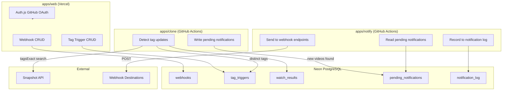

# Tag Watch & Webhook 設計書

## 概要

2つの独立した機能を組み合わせる:

1. **Webhook 通知機能** — 登録された Webhook エンドポイントにペイロードを送信する汎用インフラ
2. **タグ更新検知機能** — 指定タグの新着動画を検知し、Webhook 通知機能を発火させるトリガー

## モノレポ構成

```
nicolens/
  apps/
    web/       — Next.js app (認証 + Webhook CRUD + Tag Trigger CRUD)
    clone/     — タグ更新検知 (Snapshot API → watch_results)
    notify/    — Webhook 送信 (pending_notifications → webhook endpoints)
  packages/
    tsconfig/  — 共有 TypeScript config (既存)
    datastore/ — 共有 DB schema + connection
```

### パッケージ間の責務

| App | 知っていること | 知らないこと |
|-----|-------------|------------|
| web | ユーザー、Webhook、Tag Trigger | Snapshot API の叩き方、通知の送り方 |
| clone | タグ、Snapshot API、watch_results | Webhook の存在、通知の送り方 |
| notify | pending_notifications、Webhook URL | タグ、Snapshot API |

clone は「何が新しいか」を発見し、pending_notifications に書く。notify は「どこに送るか」を処理する。互いを知らない。

## 認証

Auth.js v5 + GitHub OAuth + Drizzle Adapter。

設定: `apps/web/src/shared/auth/config.ts`
ハンドラ: `app/api/auth/[...nextauth]/route.ts`
ミドルウェア: `apps/web/middleware.ts` で `/watches`, `/webhooks`, `/api/watches`, `/api/webhooks` を保護

環境変数:
- `AUTH_SECRET`
- `AUTH_GITHUB_ID`
- `AUTH_GITHUB_SECRET`

## データモデル

### Auth.js テーブル (Drizzle Adapter 標準)

```
users:              id, name, email, emailVerified, image
accounts:           id, userId, type, provider, providerAccountId, ...
sessions:           sessionToken (PK), userId, expires
verificationTokens: identifier + token (composite PK), expires
```

### webhooks テーブル (汎用通知インフラ)

| カラム | 型 | 説明 |
|--------|-----|------|
| id | TEXT (UUID) | PK |
| user_id | TEXT | FK → users.id |
| name | TEXT | 表示名 (例: "My Discord") |
| url | TEXT | エンドポイント URL |
| format | TEXT | "generic" or "discord" |
| is_active | BOOLEAN | |
| created_at | TIMESTAMP | |

INDEX: (user_id)

### tag_triggers テーブル (トリガー)

| カラム | 型 | 説明 |
|--------|-----|------|
| id | TEXT (UUID) | PK |
| user_id | TEXT | FK → users.id |
| tag | TEXT | 監視対象タグ |
| webhook_id | TEXT | FK → webhooks.id |
| is_active | BOOLEAN | |
| created_at | TIMESTAMP | |

INDEX: (user_id)
UNIQUE: (user_id, tag, webhook_id)

### watch_results テーブル (clone が書き込み)

| カラム | 型 | 説明 |
|--------|-----|------|
| tag | TEXT | タグ名 |
| content_id | TEXT | 動画 ID |
| video_data | TEXT | VideoContent の JSON |
| discovered_at | TIMESTAMP | |

PK: (tag, content_id)
INDEX: (discovered_at) — クリーンアップ用

### pending_notifications テーブル (clone が書き込み、notify が処理)

clone と notify の間の**キュー**。clone がトリガー条件を評価して通知対象を決定し、pending に書く。notify はそれを読んで送信する。

| カラム | 型 | 説明 |
|--------|-----|------|
| id | TEXT (UUID) | PK |
| webhook_id | TEXT | FK → webhooks.id |
| payload | TEXT | 送信する JSON ペイロード |
| created_at | TIMESTAMP | |

INDEX: (created_at)

### notification_log テーブル (notify が書き込み)

| カラム | 型 | 説明 |
|--------|-----|------|
| id | TEXT (UUID) | PK |
| webhook_id | TEXT | FK → webhooks.id |
| trigger_type | TEXT | "tag" (将来の拡張用) |
| trigger_id | TEXT | tag_triggers.id |
| content_id | TEXT | 通知した動画 ID |
| sent_at | TIMESTAMP | |
| success | BOOLEAN | |

UNIQUE: (trigger_id, content_id)
INDEX: (sent_at) — クリーンアップ用

## アーキテクチャ



### Clone の処理フロー

```
1. tag_triggers (is_active=true) の tag を DISTINCT で取得
2. 各 tag について:
   a. snapshot API: q={tag}&targets=tagsExact&filters[startTime][gte]={前日JST5:00}
   b. 結果を watch_results に upsert (onConflictDoNothing)
3. 各 tag_trigger について:
   a. watch_results[tag] のうち notification_log[trigger_id] に無い content_id を取得
   b. 該当動画の webhook_id + ペイロードを pending_notifications に挿入
4. 90日以上前の watch_results を削除
```

### Notify の処理フロー

```
1. pending_notifications の全レコードを取得
2. 各 pending について:
   a. webhooks[webhook_id] から url, format を取得
   b. format に応じてペイロードを整形 (generic/discord)
   c. url に POST
   d. notification_log に記録 (success/failure)
   e. pending_notifications から削除
3. 90日以上前の notification_log を削除
```

notify は Webhook の url と format と payload しか知らない。タグの存在すら知らない。

## API エンドポイント (apps/web)

全て認証必須。操作対象は必ず `WHERE user_id = session.user.id` で絞り込み。

### Webhooks

| Method | Path | 説明 |
|--------|------|------|
| GET | /api/webhooks | ユーザーの Webhook 一覧 |
| POST | /api/webhooks | Webhook 登録 |
| PATCH | /api/webhooks/[id] | 更新 (name, url, format, isActive) |
| DELETE | /api/webhooks/[id] | 削除 (紐づく trigger も CASCADE) |

### Tag Triggers

| Method | Path | 説明 |
|--------|------|------|
| GET | /api/watches | ユーザーの Tag Trigger 一覧 (webhook 情報含む) |
| POST | /api/watches | Tag Trigger 追加 (tag + webhook_id) |
| PATCH | /api/watches/[id] | 更新 (isActive) |
| DELETE | /api/watches/[id] | 削除 |

## UI

### ヘッダー

- 未ログイン: 「GitHubでログイン」ボタン
- ログイン済み: アバター + ドロップダウン (Webhooks, Tag Watches, ログアウト)

### /webhooks ページ

- Webhook 一覧 (名前、URL マスク、形式、有効/無効)
- 追加フォーム: 名前 + URL + 形式 (Generic/Discord)
- テスト送信ボタン (テストペイロードを送信)

### /watches ページ

- Tag Trigger 一覧 (タグ名、送信先 Webhook 名、有効/無効)
- 追加フォーム: タグ名 + Webhook セレクト (登録済み Webhook から選択)
- 最近の通知ログ

### 検索結果ページ

タグピルに「監視」アクション追加。ログイン済み + Webhook 登録済みなら、Webhook を選択して即追加。

## Webhook ペイロード

### Generic

```json
{
  "trigger": { "type": "tag", "tag": "VOCALOID" },
  "videos": [
    {
      "contentId": "sm12345678",
      "title": "Example",
      "url": "https://nico.ms/sm12345678",
      "thumbnailUrl": "https://...",
      "viewCounter": 1234,
      "startTime": "2026-04-12T10:00:00+09:00"
    }
  ],
  "sentAt": "2026-04-12T05:10:00+09:00",
  "totalNew": 1
}
```

### Discord

embed 形式。最大10件/メッセージ。

## セキュリティ

- Webhook URL: SSRF 対策
  - private IP 拒否: 127.0.0.0/8, 10.0.0.0/8, 172.16.0.0/12, 192.168.0.0/16, 169.254.0.0/16
  - IPv6: ::1, fc00::/7 拒否
  - https only
- API: 全エンドポイントで auth() + user_id 所有権検証
- GitHub Actions: secrets で DATABASE_URL 管理

## FSD レイヤー配置

```
src/shared/auth/
  config.ts                — Auth.js 設定

src/features/auth/
  ui/auth-button.tsx       — ログイン/ログアウト
  ui/user-menu.tsx         — アバター + ドロップダウン
  index.ts

src/features/webhook/
  ui/webhook-list.tsx      — Webhook 一覧
  ui/webhook-form.tsx      — Webhook 追加フォーム
  index.ts

src/features/tag-watch/
  ui/tag-watch-list.tsx    — Trigger 一覧
  ui/tag-watch-form.tsx    — Trigger 追加フォーム
  index.ts

src/pages/webhooks/       — /webhooks ページ
src/pages/watches/        — /watches ページ

app/api/auth/[...nextauth]/route.ts
app/api/webhooks/route.ts
app/api/webhooks/[id]/route.ts
app/api/watches/route.ts
app/api/watches/[id]/route.ts
app/webhooks/page.tsx
app/watches/page.tsx
```
