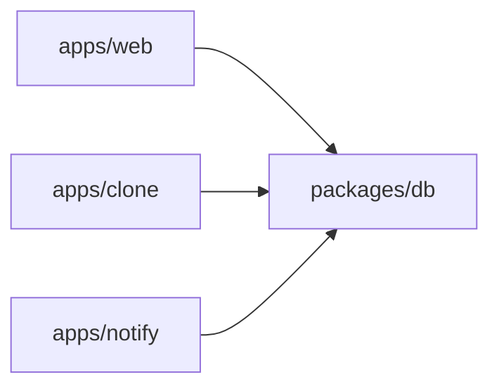
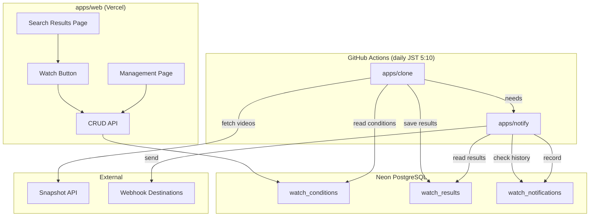

# Watch & Webhook 設計書

Snapshot API の日次更新を検知し、ユーザーごとの検索条件に合致する新着動画を指定の webhook URL へ通知する機能。

## 制約

| 制約 | 値 | 影響 |
|------|-----|------|
| GitHub Actions (public) | 月無制限 / ジョブ6時間 | clone/notify の実行環境。タイムアウトの心配不要 |
| GitHub Actions (private) | 月2,000分 | 1日2ジョブ × 数分 ≈ 月60分。余裕あり |
| Neon free tier ストレージ | 0.5GB | 通知ログ・cloneデータの保持期間を制限 |
| Snapshot API レート制限 | レスポンス時間と同等の待機 | 実測100-200ms/リクエスト |
| Snapshot API の性質 | 検索API (差分APIではない) | startTime フィルタで新着を絞り込む |
| 認証 | なし | UUID トークンでアクセス制御 |

## モノレポ構成

```
nicolens/
  apps/
    web/       — Next.js app (検索 UI + watch CRUD API)
    clone/     — Snapshot clone service (API → DB)
    notify/    — Notification service (DB → webhook)
  packages/
    tsconfig/  — 共有 TypeScript config (既存)
    db/        — 共有 DB schema + connection
```

### パッケージ間の依存関係



- `packages/db` は `drizzle-orm` と `postgres` を持ち、schema と connection を export
- 各 app は `@nicolens/db` として import
- `apps/web` の既存コードは `@/shared/db` → `@nicolens/db` に変更

## アーキテクチャ

### 全体フロー



### 処理シーケンス

```
GitHub Actions cron (JST 5:10)

Job 1: clone
  1. DB から is_active=true の全 watch_conditions を取得
  2. 各 condition について:
     a. query/targets/filters から snapshot API クエリを組み立て
     b. startTime >= last_cloned_at を追加 (新着のみ)
     c. snapshot API を呼び出し (limit=100)
     d. 結果を watch_results に upsert (onConflictDoNothing)
     e. condition.last_cloned_at を更新
  3. 90日以上前の watch_results を削除

Job 2: notify (depends on clone)
  1. DB から is_active=true の全 watch_conditions を取得
  2. 各 condition について:
     a. watch_results から、watch_notifications に無い content_id を取得
     b. 該当動画が無ければスキップ
     c. webhook_url へペイロードを POST
     d. watch_notifications に記録
  3. 90日以上前の watch_notifications を削除
```

## データモデル

### watch_conditions テーブル

| カラム | 型 | 説明 |
|--------|-----|------|
| id | TEXT (UUID) | PK |
| token | TEXT (UUID) | 管理ページアクセス用 |
| label | TEXT | ユーザーが付けるラベル |
| query | TEXT | 検索キーワード |
| targets | TEXT | 検索対象フィールド |
| filters_json | TEXT | startTime 以外のフィルタ (JSON string) |
| webhook_url | TEXT | 通知先 URL |
| webhook_format | TEXT | "generic" or "discord" |
| is_active | BOOLEAN | 一時停止フラグ |
| last_cloned_at | TIMESTAMP | clone が最後にチェックした日時 |
| created_at | TIMESTAMP | 作成日時 |

### watch_results テーブル (clone が書き込み、notify が読み取り)

| カラム | 型 | 説明 |
|--------|-----|------|
| condition_id | TEXT | FK → watch_conditions.id |
| content_id | TEXT | ニコニコの動画 ID |
| video_data | TEXT | VideoContent の JSON string |
| discovered_at | TIMESTAMP | clone が発見した日時 |

PK: (condition_id, content_id)

### watch_notifications テーブル (notify が書き込み)

| カラム | 型 | 説明 |
|--------|-----|------|
| id | TEXT (UUID) | PK |
| condition_id | TEXT | FK → watch_conditions.id |
| content_id | TEXT | 通知済み動画 ID |
| notified_at | TIMESTAMP | 通知送信日時 |

UNIQUE: (condition_id, content_id)
INDEX: (notified_at) — 古いログ削除用

## API エンドポイント (apps/web)

### POST /api/watch

条件を新規作成する。

### GET /api/watch/[token]

トークンに紐づく条件の詳細 + 直近通知履歴を取得する。

### PATCH /api/watch/[token]

条件を更新する (label, webhookUrl, is_active 等)。

### DELETE /api/watch/[token]

条件を削除する。関連テーブルも CASCADE で削除。

## Webhook ペイロード

### Generic 形式

```json
{
  "condition": { "id": "uuid", "label": "VOCALOID新着", "query": "VOCALOID" },
  "videos": [
    {
      "contentId": "sm12345678",
      "title": "Example Title",
      "url": "https://nico.ms/sm12345678",
      "thumbnailUrl": "https://...",
      "viewCounter": 1234,
      "startTime": "2026-04-11T10:00:00+09:00"
    }
  ],
  "checkedAt": "2026-04-11T05:10:00+09:00",
  "totalNew": 1
}
```

### Discord 形式

Discord Webhook API の embed 形式に変換。最大10 embeds/メッセージ。超過分は複数回送信。

## UI

### 検索結果ページ

既存ツールバーに Bell アイコンの Watch ボタンを追加。DropdownMenu で:
1. ラベル入力
2. Webhook URL 入力
3. 形式選択 (Generic / Discord)
4. 保存 → 管理用 URL 表示

### /watch/[token] 管理ページ

条件詳細、有効/無効トグル、最終チェック日時、直近通知履歴、削除ボタン。

## セキュリティ

- Webhook URL: SSRF 対策 (private IP 拒否、https only)
- トークン: UUID v4 (122bit entropy)
- GitHub Actions: secrets で DATABASE_URL を管理

## 実行環境

GitHub Actions cron で実行。Vercel Cron は使わない (10秒制限を回避)。

```yaml
# .github/workflows/watch.yml
on:
  schedule:
    - cron: '10 20 * * *'  # UTC 20:10 = JST 5:10
jobs:
  clone:
    runs-on: ubuntu-latest
    steps:
      - checkout, pnpm install
      - pnpm --filter @nicolens/clone start
  notify:
    needs: clone
    runs-on: ubuntu-latest
    steps:
      - checkout, pnpm install
      - pnpm --filter @nicolens/notify start
```

## ファイル配置

```
packages/db/
  src/
    schema.ts          — 全テーブル定義
    connection.ts      — getDb()
    index.ts           — barrel
  drizzle.config.ts
  package.json         — @nicolens/db
  tsconfig.json

apps/clone/
  src/
    index.ts           — entry: read conditions, fetch API, save results
    clone-handler.ts   — core logic
  package.json         — @nicolens/clone
  tsconfig.json

apps/notify/
  src/
    index.ts           — entry: evaluate conditions, send webhooks
    notify-handler.ts  — core logic
    webhook-formats.ts — Generic/Discord payload builders
    webhook-sender.ts  — HTTP sender
    url-validator.ts   — SSRF prevention
  package.json         — @nicolens/notify
  tsconfig.json

apps/web/
  app/api/watch/
    route.ts             — POST (create)
    [token]/route.ts     — GET/PATCH/DELETE
  app/watch/[token]/
    page.tsx             — management page (thin wrapper)
  src/features/watch/
    ui/watch-button.tsx  — search results toolbar button
    index.ts
  src/pages/watch/
    ui/watch-page.tsx    — page composition
    index.ts

.github/workflows/
  watch.yml              — cron schedule for clone + notify
```
