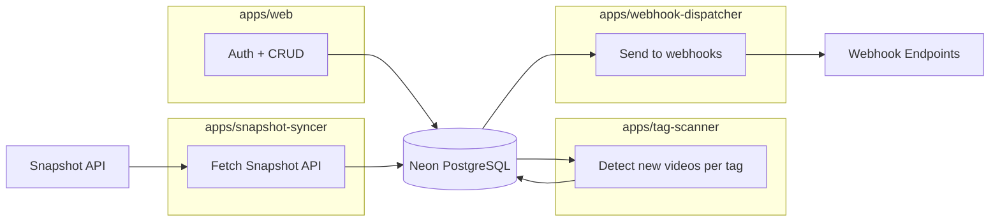

# Tag Watch & Webhook 設計書

## 概要

3つの独立した機能をパイプラインとして組み合わせる:

1. **Snapshot 同期** — Snapshot API のデータを自前 DB にミラーする
2. **タグ検知** — 自前 DB から指定タグの新着を検知し、通知キューに書く
3. **Webhook 配信** — 通知キューを処理して Webhook エンドポイントに送信する

## 4サービス構成

```
nicolens/
  apps/
    web/                  — Next.js (認証 + Webhook CRUD + Tag Trigger CRUD)
    snapshot-syncer/      — Snapshot API → watch_results (データ取得)
    tag-scanner/          — watch_results → pending_notifications (検知)
    webhook-dispatcher/   — pending_notifications → Webhook endpoints (配信)
  packages/
    tsconfig/             — 共有 TypeScript config (既存)
    datastore/            — 共有 DB schema + connection
```

### パッケージ間の責務

| App | 入力 → 出力 | 外部依存 |
|-----|-----------|---------|
| web | ユーザー操作 → DB | GitHub OAuth |
| snapshot-syncer | Snapshot API → `watch_results` | ニコニコ API (読み取り) |
| tag-scanner | `watch_results` → `pending_notifications` | **なし** (DB only) |
| webhook-dispatcher | `pending_notifications` → Webhook | 外部 HTTP (書き込み) |

各サービスの外部依存は片方向に最大1つ。tag-scanner は純粋なDB操作で、外部APIを一切知らない。

### 実行パイプライン (GitHub Actions)

```
snapshot-syncer → tag-scanner → webhook-dispatcher
     (API→DB)      (DB→DB)        (DB→HTTP)
```

`needs` で順序保証。各ジョブは独立してリトライ可能。

## 認証

Auth.js v5 + GitHub OAuth + Drizzle Adapter。

設定: `apps/web/src/shared/auth/config.ts`
ハンドラ: `app/api/auth/[...nextauth]/route.ts`
ミドルウェア: `apps/web/middleware.ts` で `/watches`, `/webhooks`, `/api/watches`, `/api/webhooks` を保護

環境変数: `AUTH_SECRET`, `AUTH_GITHUB_ID`, `AUTH_GITHUB_SECRET`

## データモデル

### Auth.js テーブル (Drizzle Adapter 標準)

```
users:              id, name, email, emailVerified, image
accounts:           id, userId, type, provider, providerAccountId, ...
sessions:           sessionToken (PK), userId, expires
verificationTokens: identifier + token (composite PK), expires
```

### webhooks テーブル (汎用通知インフラ)

| カラム | 型 | 説明 |
|--------|-----|------|
| id | TEXT (UUID) | PK |
| user_id | TEXT | FK → users.id |
| name | TEXT | 表示名 |
| url | TEXT | エンドポイント URL |
| format | TEXT | "generic" or "discord" |
| is_active | BOOLEAN | |
| created_at | TIMESTAMP | |

INDEX: (user_id)

### tag_triggers テーブル (トリガー)

| カラム | 型 | 説明 |
|--------|-----|------|
| id | TEXT (UUID) | PK |
| user_id | TEXT | FK → users.id |
| tag | TEXT | 監視対象タグ |
| webhook_id | TEXT | FK → webhooks.id |
| is_active | BOOLEAN | |
| created_at | TIMESTAMP | |

INDEX: (user_id)
UNIQUE: (user_id, tag, webhook_id)

### watch_results テーブル (snapshot-syncer が書き込み、tag-scanner が読み取り)

Snapshot API のローカルミラー。タグ単位で保存。

| カラム | 型 | 説明 |
|--------|-----|------|
| tag | TEXT | タグ名 |
| content_id | TEXT | 動画 ID |
| video_data | TEXT | VideoContent の JSON |
| discovered_at | TIMESTAMP | |

PK: (tag, content_id)
INDEX: (discovered_at)

### pending_notifications テーブル (tag-scanner が書き込み、webhook-dispatcher が処理)

サービス間のメッセージキュー。

| カラム | 型 | 説明 |
|--------|-----|------|
| id | TEXT (UUID) | PK |
| webhook_id | TEXT | FK → webhooks.id |
| payload | TEXT | 送信する JSON ペイロード |
| created_at | TIMESTAMP | |

INDEX: (created_at)

### notification_log テーブル (webhook-dispatcher が書き込み)

| カラム | 型 | 説明 |
|--------|-----|------|
| id | TEXT (UUID) | PK |
| webhook_id | TEXT | FK → webhooks.id |
| trigger_type | TEXT | "tag" (将来拡張用) |
| trigger_id | TEXT | tag_triggers.id |
| content_id | TEXT | |
| sent_at | TIMESTAMP | |
| success | BOOLEAN | |

UNIQUE: (trigger_id, content_id)
INDEX: (sent_at)

## 処理フロー

### snapshot-syncer

```
1. tag_triggers (is_active=true) の tag を DISTINCT で取得
2. 各 tag について:
   a. q={tag}&targets=tagsExact&filters[startTime][gte]={前日JST5:00}
   b. Snapshot API 呼び出し (limit=100)
   c. watch_results に upsert (onConflictDoNothing)
3. 90日以上前の watch_results を削除
```

知っていること: タグ名、Snapshot API
知らないこと: Webhook、pending、ユーザー

### tag-scanner

```
1. tag_triggers (is_active=true) を全件取得
2. 各 trigger について:
   a. watch_results[tag] のうち notification_log[trigger_id] に無い content_id を取得
   b. 該当なしならスキップ
   c. video_data からペイロードを構築
   d. pending_notifications に挿入 (webhook_id, payload)
```

知っていること: tag_triggers、watch_results、notification_log
知らないこと: Snapshot API、Webhook URL、送信方法

### webhook-dispatcher

```
1. pending_notifications を全件取得
2. 各 pending について:
   a. webhooks[webhook_id] から url, format を取得
   b. format に応じてペイロードを整形 (generic/discord)
   c. url に POST
   d. notification_log に記録
   e. pending から削除
3. 90日以上前の notification_log を削除
```

知っていること: pending_notifications、webhooks テーブル
知らないこと: タグ、Snapshot API、トリガーの種類

## アーキテクチャ



## GitHub Actions

```yaml
name: Tag Watch Pipeline
on:
  schedule:
    - cron: '10 20 * * *' # JST 5:10
  workflow_dispatch:

jobs:
  sync:
    runs-on: ubuntu-latest
    steps:
      - checkout, setup-node, pnpm install
      - pnpm --filter @nicolens/snapshot-syncer start
    env:
      DATABASE_URL: ${{ secrets.DATABASE_URL }}

  scan:
    needs: sync
    runs-on: ubuntu-latest
    steps:
      - checkout, setup-node, pnpm install
      - pnpm --filter @nicolens/tag-scanner start
    env:
      DATABASE_URL: ${{ secrets.DATABASE_URL }}

  dispatch:
    needs: scan
    runs-on: ubuntu-latest
    steps:
      - checkout, setup-node, pnpm install
      - pnpm --filter @nicolens/webhook-dispatcher start
    env:
      DATABASE_URL: ${{ secrets.DATABASE_URL }}
```

## API エンドポイント (apps/web)

全て認証必須。`WHERE user_id = session.user.id` で所有権検証。

### Webhooks

| Method | Path | 説明 |
|--------|------|------|
| GET | /api/webhooks | 一覧 |
| POST | /api/webhooks | 登録 |
| PATCH | /api/webhooks/[id] | 更新 |
| DELETE | /api/webhooks/[id] | 削除 (CASCADE) |

### Tag Triggers

| Method | Path | 説明 |
|--------|------|------|
| GET | /api/watches | 一覧 |
| POST | /api/watches | 追加 (tag + webhook_id) |
| PATCH | /api/watches/[id] | 更新 (isActive) |
| DELETE | /api/watches/[id] | 削除 |

## UI

### ヘッダー

- 未ログイン: 「GitHubでログイン」
- ログイン済み: アバター + ドロップダウン (Webhooks, Tag Watches, ログアウト)

### /webhooks

Webhook 一覧 + 追加フォーム (名前, URL, 形式)

### /watches

Tag Trigger 一覧 + 追加フォーム (タグ名, Webhook セレクト)

## Webhook ペイロード

### Generic

```json
{
  "trigger": { "type": "tag", "tag": "VOCALOID" },
  "videos": [{ "contentId": "sm12345", "title": "...", "url": "https://nico.ms/sm12345", ... }],
  "sentAt": "2026-04-12T05:10:00+09:00",
  "totalNew": 1
}
```

### Discord

embed 形式。最大10件/メッセージ。

## セキュリティ

- Webhook URL: SSRF 対策 (private IP 拒否、169.254.0.0/16, fc00::/7, ::1 含む、https only)
- API: 全エンドポイントで auth() + user_id 所有権検証
- GitHub Actions: secrets で DATABASE_URL 管理

## FSD レイヤー配置

```
src/shared/auth/
  config.ts

src/features/auth/
  ui/auth-button.tsx
  ui/user-menu.tsx
  index.ts

src/features/webhook/
  ui/webhook-list.tsx
  ui/webhook-form.tsx
  index.ts

src/features/tag-watch/
  ui/tag-watch-list.tsx
  ui/tag-watch-form.tsx
  index.ts

src/pages/webhooks/
src/pages/watches/

app/api/auth/[...nextauth]/route.ts
app/api/webhooks/route.ts
app/api/webhooks/[id]/route.ts
app/api/watches/route.ts
app/api/watches/[id]/route.ts
app/webhooks/page.tsx
app/watches/page.tsx
```
